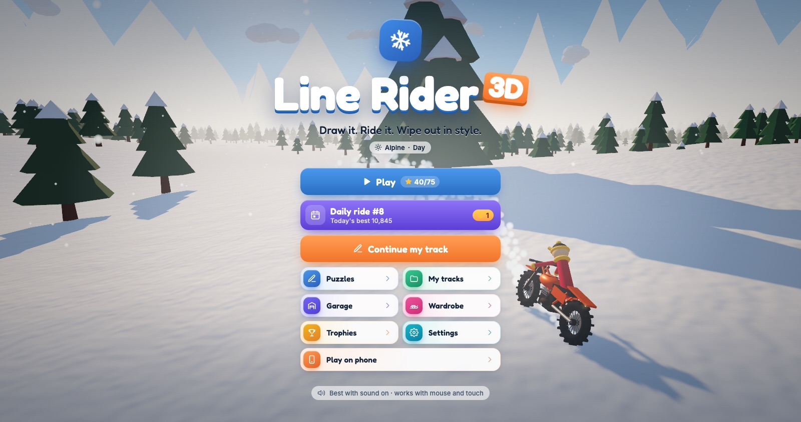
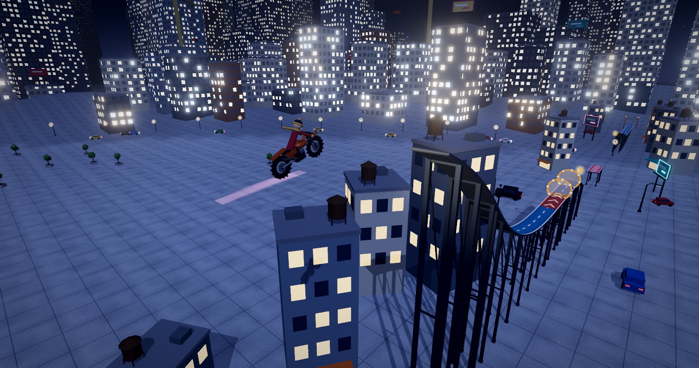
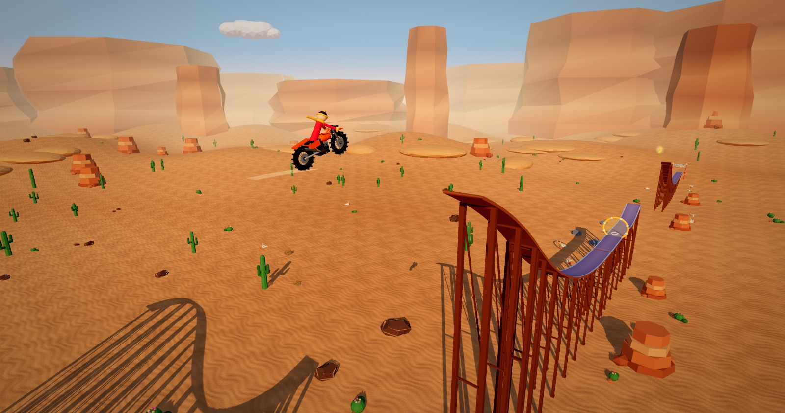
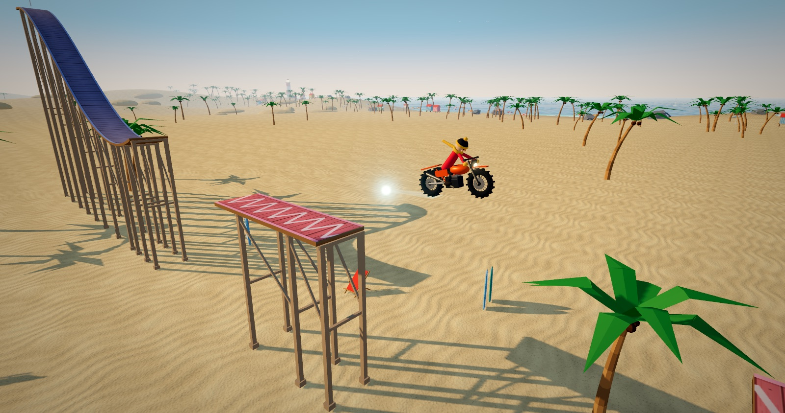
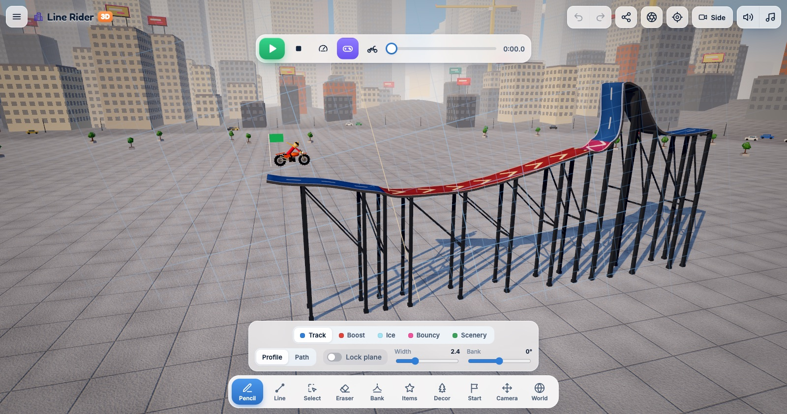
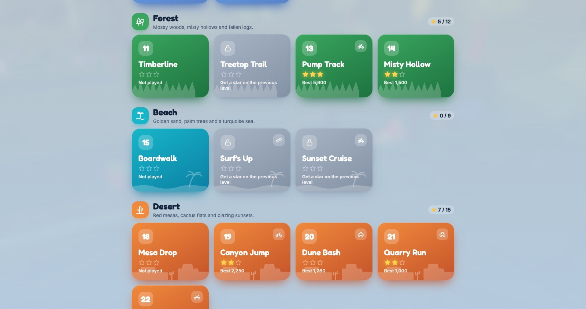
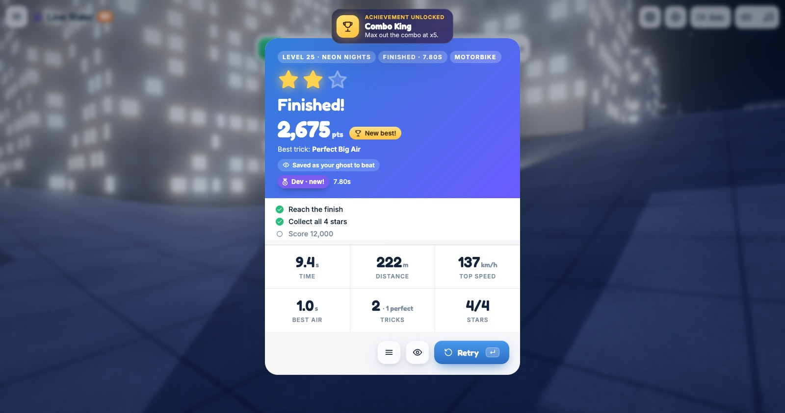

# Line Rider 3D

**Draw it. Ride it. Wipe out in style.** A 3D take on the classic Line Rider: draw a track, then watch
Bosh ride it on a sled, skis, a snowboard, a BMX, a motorbike or a buggy, across five worlds.

<p align="center">
  <a href="https://manuelsiuro.github.io/LineRider3D/"><b>▶&nbsp; Play now: manuelsiuro.github.io/LineRider3D</b></a>
  <br />
  <sub>Free, in the browser, on desktop and mobile. On a phone, use “Add to Home Screen” to install it: it then plays offline.</sub>
</p>

<p align="center">
  <a href="https://manuelsiuro.github.io/LineRider3D/"></a>
</p>

<table>
  <tr>
    <td width="50%"></td>
    <td width="50%"></td>
  </tr>
  <tr>
    <td align="center"><sub>Neon Nights: big air over the city after dark</sub></td>
    <td align="center"><sub>Mesa Drop: off the top of the mesa</sub></td>
  </tr>
  <tr>
    <td width="50%"></td>
    <td width="50%"></td>
  </tr>
  <tr>
    <td align="center"><sub>Boardwalk: bouncy pads by the sea</sub></td>
    <td align="center"><sub>The editor: draw tracks, boosts, ice and trampolines</sub></td>
  </tr>
  <tr>
    <td width="50%"></td>
    <td width="50%"></td>
  </tr>
  <tr>
    <td align="center"><sub>25 levels in five worlds: Alpine, Forest, Beach, Desert, City</sub></td>
    <td align="center"><sub>Stars, medals, tricks, combos and achievements</sub></td>
  </tr>
</table>

## Highlights

- **Draw anything**: pencil and line tools, boost, ice and bouncy lines, banked turns, rings, stars, a finish gate and scenery.
- **Six rides**, each with its own physics, and a **rider mode** to push, brake, spin and flip yourself.
- **Five worlds** with dawn, day, sunset and night, plus rain, snow, fog, storms and sandstorms.
- **25 levels**, a **daily ride** that's new every day, **puzzles** to fix broken tracks, medals and a ghost to race.
- **Share** any track or challenge as a link, take shots in **photo mode**, and play offline as an installed app.

## Development

Built with Three.js, TypeScript and Vite.

```bash
npm install
npm run dev            # http://localhost:5173 (also exposed on your LAN for phones)
npm run build          # type-check + production build in dist/
npm test               # headless checks in parallel: physics, controls, scoring, ghosts, every level
npm test -- level      # only tests whose file name contains "level"
npm test -- -u         # accept intended changes as the new golden outputs
```

The simulation is deterministic, so every test's output is compared with a golden copy in
`scripts/snapshots/`: any drift in a trajectory, score or timing fails the run. One-off
investigation probes live in `scripts/dev/` (run them with `npx tsx scripts/dev/<name>.ts`).
CI (`.github/workflows/ci.yml`) runs the build and the tests on every push, and publishes `main` to GitHub Pages.

The production build is an installable web app: `public/manifest.webmanifest` and the icons, plus `sw.js`, a
service worker written by `vite-sw.ts` after each build that stores the whole game on the device. A new
deploy downloads in the background and takes over on the next launch. On the title screen, "Play on phone"
shows a QR code of the game's address (in dev, the server's Wi-Fi address).

## How it plays

- **Profile mode**: draw on a vertical plane facing the camera, like classic Line Rider.
  Orbit the camera to turn the plane (snaps every 15°), or lock it.
- **Path mode**: draw on a horizontal plane; the ribbon descends with the chosen grade
  and turns are **auto-banked** inward like a bobsled run.
- Start a stroke on another track's endpoint (orange ring) to connect them.
- Tracks are one-sided: the colored face is solid (draw left → right for a floor).
- Line types: **Track** (blue), **Boost** (red, accelerates along drawing direction), **Ice** (no friction, no sideways grip),
  **Bouncy** (trampoline), **Scenery** (green, no collision).
- **Boost rings**: place a golden hoop on a track or in the air; riding through it launches Bosh.
- Tools: Pencil, Line, Select, Eraser, Bank (drag to tilt a track), Items, Decor, Start flag, Camera, World.
- **Select** (X): drag a box or click lines (shift adds), drag to move, Ctrl/⌘ C / V to copy and paste,
  M mirror (floors stay floors), N smooth, Delete. Each is one undo step.
- **Test from here** (T): rides from the point under the pointer; Stop puts the start flag back.
- Timeline scrubbing is exact: the simulation is deterministic at 40 steps/s and every frame is recorded.

## Game modes

- **Play**: 25 built-in levels in five worlds, each teaching a mechanic. Every level has three goals
  (reach the finish, collect all stars, reach the target score) worth one star each, plus finish-time
  **medals** (bronze, silver, gold, dev) per ride on the level's home world. Total stars unlock outfits.
- **Daily ride**: a new generated track every UTC day, the same for everyone (with the day's ride and
  world). Your best counts, a streak keeps track of the days in a row, **Share score** sends a link to
  that day's track with your score and ghost to beat.
- **Puzzles** ("Fix the track"): a broken track and a little ink. Draw what's missing, press Play;
  one star for finishing, two with every star, three within par.
- **Create**: the track editor. Add stars, boost rings and a finish gate with the **Items** tool and set
  the target score, then share it. Every track is kept in **My tracks** (rename, duplicate, delete).
- **Share**: the ⤴ button (or ☰ › Share link) puts the whole track in a link. From a run summary,
  **Challenge** shares the track with your score and your run: your friend races your ghost.
- **Photo mode** (P): freeze the moment, orbit, change the field of view, time of day and weather,
  hide Bosh, and snap a PNG.

## Rider mode

Toggle the 🎮 button in the player bar to control Bosh:

- **→ / ↑** push (on a track, up to ~50 km/h) · **← / ↓** brake
- In the air the same keys **flip** Bosh forward / backward; release to stop spinning.
  Landing mid-spin is a wipeout. Frontflip / Backflip 1000, Double 4000, Triple 9000 (+ airtime),
  Big Air, rings +250.
- **Landing grades**: Perfect ×2 (flat on the slope, not spinning), Good ×1, Sketchy ×½.
- **Combos**: tricks, rings and stars chained within 3.5 s raise a multiplier up to ×5; a finished
  chain cashes in with a callout (a crash loses it).
- **Ghost**: your best run on each track rides alongside you as a translucent Bosh, with a live
  time gap in the HUD (green ahead, red behind).
- Touch screens get on-screen Push / Brake buttons.
- Inputs are recorded per frame, so runs stay deterministic: **Replay** shows exactly what you did,
  and rewinding the timeline then playing lets you retry from that moment.
- Best score is kept per track.

## Presentation

- Title screen with a live demo run and cinematic camera behind it
- Bloom, sky reflections, color grading, speed trail, snow particles, camera shake
- Procedural WebAudio sound (wind, runners, snow, crash, rings, bounces) and ambient music
- Live speed gauge, airtime, combo meter, callouts and an end-of-run summary with a 3-star rating
- Bullet time on big landings and slow-motion wipeouts

## Code map

| Path | Role |
| --- | --- |
| `src/main.ts` | Wiring and the menu flows (title, levels, daily, puzzles, summary) |
| `src/app/` | Session state, run controller, world director, camera moves, rides, quality, input |
| `src/track/` | Track data, stroke frames (banking), spatial hash, (de)serialization |
| `src/physics/` | Verlet ragdoll rider (`Rider.ts`) and recorded fixed-step `Simulation.ts` |
| `src/render/` | Ribbon meshes, track/decor sync, Bosh model, camera rig |
| `src/editor/` | Drawing plane, snapping, tools, undo/redo |
| `src/world/` | Sky, terrain, mountains, forest, snowfall, procedural decor models |
| `src/ui/` | HTML overlay: HUD and toolbar (`UI.ts`), one file per screen in `screens/`, SVG icons |
| `src/styles/` | CSS split by area, loaded in order by `index.css` (tokens in `01-base.css`) |
| `src/audio/` | Procedural sound effects and music |
| `src/game/` | Run stats & scoring, rating, ghosts, progress, medals, daily records, gallery, storage |
| `src/levels/` | Built-in levels, daily generator, puzzles, medal table, and the builders |

Everything the game keeps lives in `localStorage` behind `src/game/storage.ts`: one module that owns
every key, reads safely (private mode, corrupt data) and migrates old saves at startup (bump
`SAVE_VERSION` and add a migration when a format changes). Tracks autosave into **My tracks**; use
the ☰ menu to export/import JSON. Medal times are generated: run `npx tsx scripts/dev/medals.ts`
after changing physics or levels (a test fails until you do).
